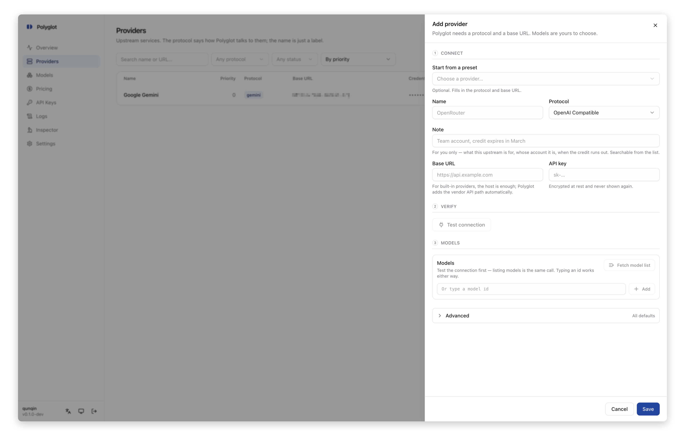
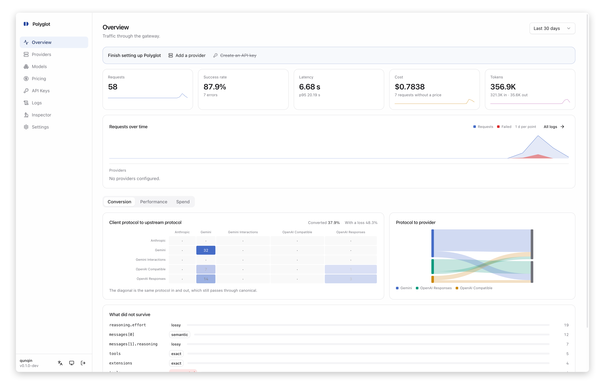
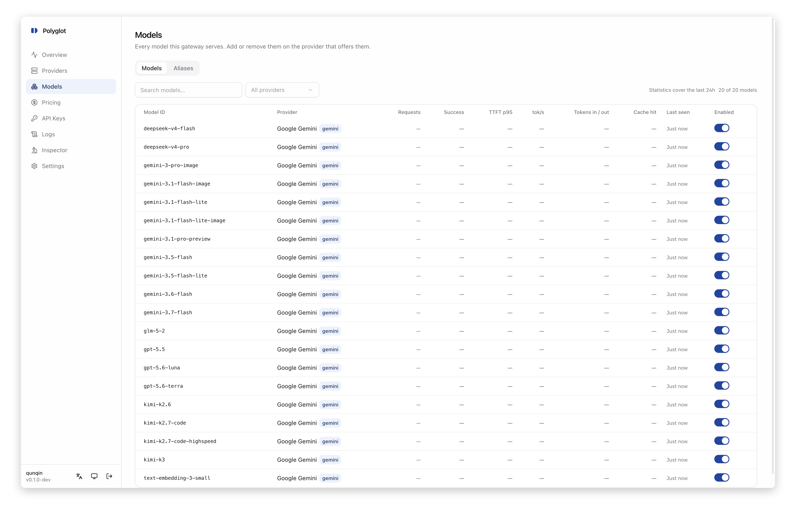
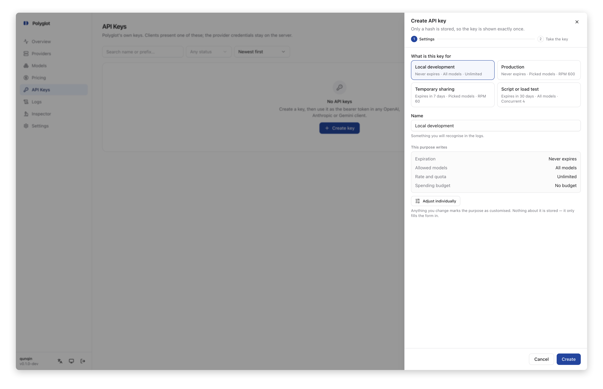
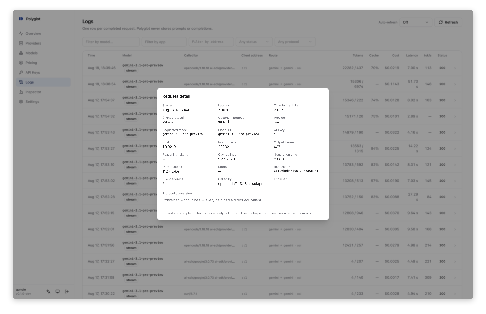
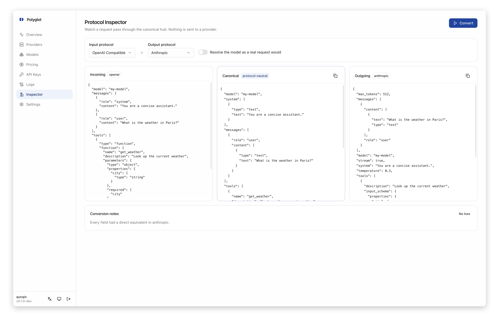
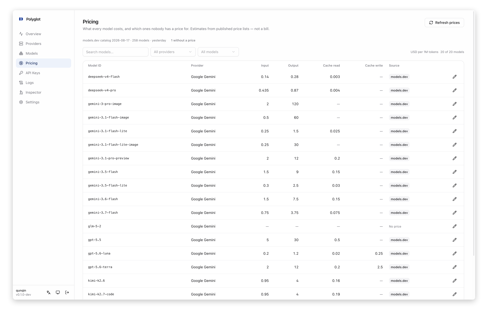
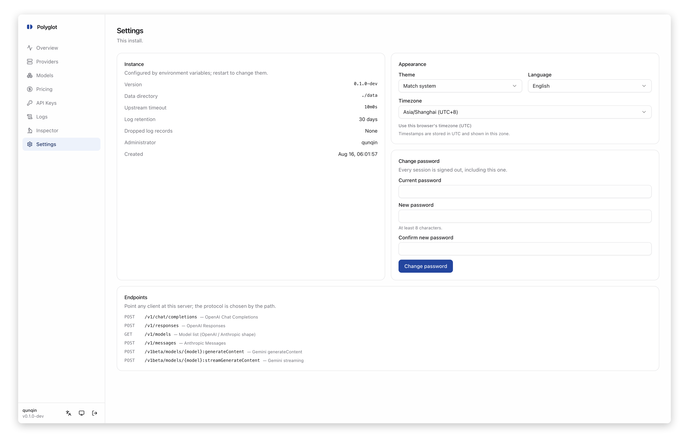

<div align="center">


# Polyglot

**The universal compatibility layer between LLM API protocols.**

*Your AI should not be defined by any one vendor.*

[中文说明](README.zh-CN.md)

</div>

---

Polyglot is a lightweight, self-hosted LLM API protocol conversion gateway. It
sits between your clients and your providers, translating any supported protocol
to any other — so the client you like and the model you want no longer need to
come from the same company.

An OpenAI SDK talks to Gemini. Claude Code talks to DeepSeek. A Gemini client
talks to Anthropic. One binary, one process, one SQLite file. No Redis, no
Postgres, no Node.js at runtime.

```
OpenAI ─────────────┐                          ┌───── OpenAI-compatible
OpenAI Responses ───┤                          ├───── OpenAI Responses
Anthropic ──────────┼──▶  Polyglot  ──▶ route ─┼───── Anthropic
Gemini ─────────────┤                          ├───── Gemini
Gemini Interactions ┘                          └───── Gemini Interactions
      clients                                          providers
```

## Why Polyglot

Most LLM proxies wrap everything into the OpenAI format and call it a day. That
works — until it doesn't: Anthropic's `cache_control` disappears, Gemini's
`thought_signature` is dropped, tool-call arguments arrive in one chunk instead
of streaming, and the cost estimate says "free" because it has no price for a
model it just relabelled.

Polyglot takes a different approach.

### How it compares

| | **Polyglot** | **LiteLLM** | **One API / New API** |
|---|---|---|---|
| **Architecture** | Canonical model — N codecs, not N² converters | Provider adapters mapping to OpenAI | Channel-based routing, OpenAI output only |
| **Protocol output** | All 5 protocols in both directions | OpenAI only | OpenAI only |
| **Field fidelity** | Every lost field is recorded and surfaced | Best-effort mapping | Best-effort mapping |
| **Replay tokens** | Gemini `thought_signature`, Anthropic `thinking` signatures carried through | Not handled | Not handled |
| **Provider params** | `guided_json`, `provider`, `prefix` etc. survive on same-protocol routes | Separate `extra_body` | Lost |
| **Provider-executed tools** | `googleSearch`, `web_search`, `file_search` forwarded on same-protocol routes | Partial | Not handled |
| **Cost tracking** | Per-request, from first-party catalog, never billing | Per-request, from own catalog | Balance-based billing system |
| **Deployment** | Single static binary, embedded UI, SQLite | Python process + optional proxy | Go/Python + MySQL/PostgreSQL + Redis |
| **Runtime dependencies** | None | Redis optional, PostgreSQL optional | MySQL or PostgreSQL, Redis |
| **Telemetry** | No usage telemetry; operator-only OTLP | Anonymous usage stats by default | None |
| **Target user** | Individual operator | Teams and enterprises | Teams running API resale |
| **Native tools** | Read from raw request — future vendor tools survive automatically | Fixed list | Fixed list |

Polyglot is not a superset of these tools. It has no billing, no multi-tenancy,
no user plans, no RBAC — and never will. It is a protocol conversion gateway for
one person's traffic, and everything it does serves that scope.

## Quick start

### Docker (recommended)

```bash
docker compose up -d
```

Tagged releases are also published to GitHub Container Registry as one
multi-architecture image for `linux/amd64` and `linux/arm64`:

```bash
docker pull ghcr.io/OWNER/REPOSITORY:latest
docker pull ghcr.io/OWNER/REPOSITORY:preview-latest
```

`latest` always means the newest stable release. `preview-latest` is a separate
channel and never replaces `latest`.

### Binary

```bash
make build
DATA_DIR=./data ./bin/polyglot
```

Open <http://localhost:3000>. On first run, read the one-time credential from
`data/setup.token` (or set `POLYGLOT_SETUP_TOKEN`) and enter it in the setup
form. Create an administrator, add a provider, then create an API key. The
token file is deleted as soon as the administrator is created.

### First provider

The provider dialog asks for a name, a base URL and credentials. When you save,
Polyglot lists the provider's models and shows them in a picker — tick the ones
you want, and they are registered. Or type a model id by hand; manual models are
first-class.



### First request

```bash
curl http://localhost:3000/v1/chat/completions \
  -H "Authorization: Bearer pg_xxx" \
  -d '{"model":"claude-sonnet-4-20250514","messages":[{"role":"user","content":"Hello"}]}'
```

The model name is the real upstream id — no mapping, no alias required.

## Supported protocols

Five protocols, each working as both client input and upstream output, giving
25 conversion pairings:

| Protocol | Client endpoint | Upstream |
|---|---|---|
| **OpenAI Chat Completions** | `POST /v1/chat/completions` | Any OpenAI-compatible API |
| **OpenAI Responses** | `POST /v1/responses` | OpenAI Responses API |
| **Anthropic Messages** | `POST /v1/messages` | Anthropic Messages API |
| **Gemini generateContent** | `POST /v1beta/models/{model}:generateContent` | Google Gemini API |
| **Gemini Interactions** | `POST /v1beta/interactions` | Google Interactions API |

Every endpoint accepts Polyglot's own API key in whichever header the client
normally uses (`Authorization: Bearer`, `x-api-key`, `x-goog-api-key`).

Streaming works on all five — SSE frames are converted event by event, including
fragmented tool-call arguments. A disconnected client tears down the upstream
connection immediately.

## Usage examples

### Point any SDK at Polyglot

**Python — OpenAI SDK:**

```python
from openai import OpenAI

client = OpenAI(
    base_url="http://localhost:3000/v1",
    api_key="pg_xxx",
)

# This can hit Gemini, Anthropic, DeepSeek — whatever
# the model routes to. Your code doesn't change.
response = client.chat.completions.create(
    model="gemini-2.5-flash",
    messages=[{"role": "user", "content": "Explain protocol buffers in one paragraph"}],
)
print(response.choices[0].message.content)
```

**Python — Anthropic SDK:**

```python
import anthropic

client = anthropic.Anthropic(
    base_url="http://localhost:3000",
    api_key="pg_xxx",
)

message = client.messages.create(
    model="gpt-4.1",  # an OpenAI model, called through the Anthropic SDK
    max_tokens=1024,
    messages=[{"role": "user", "content": "Hello"}],
)
```

**Python — Google GenAI SDK:**

```python
from google import genai

client = genai.Client(
    api_key="pg_xxx",
    http_options=genai.types.HttpOptions(api_version="v1beta", base_url="http://localhost:3000"),
)

response = client.models.generate_content(
    model="claude-sonnet-4-20250514",  # Anthropic model, Gemini SDK
    contents="What is the meaning of life?",
)
```

**Node.js — OpenAI SDK:**

```typescript
import OpenAI from "openai";

const client = new OpenAI({
  baseURL: "http://localhost:3000/v1",
  apiKey: "pg_xxx",
});

const response = await client.responses.create({
  model: "gemini-2.5-pro",
  input: "Write a haiku about protocol conversion",
});
```

### CLI tools

**Claude Code:**

```bash
export ANTHROPIC_BASE_URL=http://localhost:3000
export ANTHROPIC_AUTH_TOKEN=pg_xxx
# Claude Code now routes through Polyglot
```

**Any OpenAI-compatible CLI (aider, llm, etc.):**

```bash
export OPENAI_BASE_URL=http://localhost:3000/v1
export OPENAI_API_KEY=pg_xxx
```

### Streaming with tool calls

```bash
curl -N http://localhost:3000/v1/chat/completions \
  -H "Authorization: Bearer pg_xxx" \
  -d '{
    "model": "gemini-2.5-flash",
    "stream": true,
    "messages": [{"role": "user", "content": "What is the weather in Tokyo?"}],
    "tools": [{
      "type": "function",
      "function": {
        "name": "get_weather",
        "parameters": {"type":"object","properties":{"city":{"type":"string"}}}
      }
    }]
  }'
```

Tool-call arguments arrive as fragments and are accumulated before any JSON
parsing. Gemini needs a complete `functionCall` object, so its encoder buffers —
that is a property of the target format, handled transparently.

### Cross-protocol tool use

The same tool definition works regardless of which protocol the client speaks
or which protocol the upstream expects. Polyglot converts between OpenAI's
`tools[].function`, Anthropic's `tools[].input_schema`, and Gemini's
`tools[].functionDeclarations` — definitions, calls and results all stay paired.

### Direct provider addressing

When the same model id exists on multiple providers, use `provider::model`:

```bash
curl http://localhost:3000/v1/chat/completions \
  -H "Authorization: Bearer pg_xxx" \
  -d '{"model":"deepseek::deepseek-chat","messages":[{"role":"user","content":"Hi"}]}'
```

The separator is `::` rather than `/`, because model ids routinely contain
slashes.

## Architecture

### The canonical model

The rule that keeps this maintainable: **no protocol ever converts directly to
another.**

```
             decode                          encode
OpenAI ─────────────┐                    ┌────────▶ OpenAI
OpenAI Responses ───┤                    ├────────▶ OpenAI Responses
Anthropic ──────────┼──▶  Canonical  ──▶ ┼────────▶ Anthropic
Gemini ─────────────┤                    ├────────▶ Gemini
Gemini Interactions ┘                    └────────▶ Gemini Interactions
```

Each protocol implements one interface — `Protocol ↔ Canonical` — so five
protocols cost five codecs, not twenty-five converters. Adding a sixth protocol
means one package; all ten new pairings come for free.

Three concepts are **strictly separate**:

- **Protocol** — a wire format (`openai`, `openai-responses`, `anthropic`,
  `gemini`, `gemini-interactions`)
- **Provider** — a service you call (OpenRouter, DeepSeek, Google, Anthropic)
- **Model** — a real upstream model, discovered or hand-typed

An **alias** is an optional fourth layer: a short, stable name pointing at a
model, which you can repoint later without touching a client.

OpenRouter, DeepSeek, SiliconFlow, Groq, vLLM and Ollama are all *providers*
speaking the *OpenAI protocol*. They share one codec — only the base URL and
credentials differ.

### Model resolution

A request's `model` is resolved most-specific first:

1. `provider::model` — the provider was named outright
2. an **alias** defined in the Aliases page
3. a real **model id** from the registry

Nothing is forwarded on the chance an upstream might recognise it. A typo
returns Polyglot's own error, not a vendor's 404.

When the same model id exists on several providers, `priority` decides — a
total, stable order, never random. Among equally-ranked providers, the one
already speaking the client's protocol is preferred, because only a
same-protocol route carries extensions and native tools. This preference never
crosses a priority level.

### Conversion fidelity

Protocols are not equivalent. When a field cannot convert exactly, Polyglot
records what happened:

| Level | Meaning |
|---|---|
| `exact` | Direct, identical counterpart in the target |
| `semantic` | Expressed differently, same meaning |
| `lossy` | Carried with a loss of information |
| `unsupported` | The target protocol cannot express it |

These notes appear in the request log and the Protocol Inspector. **A dropped
field with no note is a bug** — a 5×5 matrix test enforces this on every build.

### Provider parameter passthrough

Vendor-specific parameters — OpenRouter's `provider`, vLLM's `guided_json`,
DeepSeek's `prefix` — are captured on decode and replayed on encode **when the
source and target protocol match**. Cross-protocol, they are reported as
unsupported rather than forwarded blindly.

This is not a passthrough mode. Every request still goes through canonical. The
Inspector still has a canonical form to show, and usage is still measured.

### Replay tokens

Some providers sign their output and reject the next request when the signature
is missing. Gemini 3 signs every function call:

```
Function call ... is missing a thought_signature.
```

Polyglot carries the signature through. On a different protocol it rides in the
`extra_content` envelope Google defined for its own OpenAI-compatibility layer.
When the history has no signature at all, Google's documented placeholder is
sent so the request still works, and the lost reasoning continuity is recorded
as a fidelity note.

Anthropic `thinking` signatures and OpenAI Responses reasoning items follow
the same principle.

### Multimodal

Images and PDFs convert between all five protocols. Inline base64 is always
lossless. Remote URLs are forwarded to protocols that fetch them; Gemini does
not, so that pairing is reported unless `FETCH_REMOTE_MEDIA=true`, in which
case Polyglot downloads and inlines it — with SSRF protections (private IP
refusal, size cap, type validation, redirect limits).

Audio is planned and not yet implemented. An `audio/*` attachment is refused
outright rather than forwarded as a document.

### Provider-executed tools

Gemini's `googleSearch`, Anthropic's `web_search`, OpenAI's `file_search` run
inside the provider. They have no cross-protocol equivalent, so they are
forwarded on same-protocol routes and reported on others. Gemini's server tools
are read from the raw request, not a fixed list — a tool Google ships next year
survives automatically.

## WebUI

Polyglot ships a built-in web interface embedded in the binary — no separate
frontend server, no CDN, no Node.js at runtime. It detects the browser's
language (English and Simplified Chinese) and is switchable from the sidebar.

### Overview



Dashboard with request volume, success rate, token usage and cost summary.
Shows how many requests are missing a price from the total, so a number with
gaps never reads as a complete one.

### Providers


Add, edit and remove upstream providers. The form takes a name, base URL and
credentials — credentials are encrypted at rest and never sent to the browser,
not even to the edit form. On save, Polyglot discovers the provider's model
list and offers a picker. A provider with no models is valid; models get added
later.

Shows which providers are currently cooling down after a failure.

### Models



Everything the gateway serves, across all providers. Flags ambiguous model ids
(same id on multiple providers) and shows the resolution order. Cache hit rate
is displayed as a share of tokens, not requests.

### API Keys



Create and manage Polyglot API keys. Keys are stored as SHA-256 hashes and
shown exactly once on creation. Each key shows the addresses it has been used
from, busiest first — a key suddenly used from a new address is visible here.

Optional per-key limits: requests per minute, tokens per day, and a spending
budget (a dollar cap over a window you choose).

### Request Logs



Every request logged with: protocol pair, provider, model, status, duration,
token counts (input, output, cached, reasoning), cost, TTFT, tokens per second,
the calling address, and fidelity notes. Filterable by all of these plus
`X-Title`, referer and user agent.

**No prompts or completions are ever stored.**

### Protocol Inspector



See a request as it arrived, in canonical form, and as it left — side by side.
Shows exactly what the conversion did, what was carried, what was lost, and why.
This is the debugging tool for conversion issues.

### Pricing



Per-model pricing from the embedded models.dev catalog, with operator
overrides. Shows how many models have no price. A refresh fetches the current
catalog from models.dev (a GET of a public file, sends nothing); your overrides
are stored separately and survive. An override is four nullable fields — blank
follows the catalog, so correcting one price still tracks an official cut in
the others.

### Aliases


Optional short, stable names pointing at a provider + model. Repoint an alias
and every client using it follows — no code change, no redeployment.

### Settings



Display timezone (stored per-administrator, timestamps always UTC internally),
language, and the password change form.

## Configuration

Everything that varies per deployment is an environment variable; everything
else lives in the database and is managed through the WebUI.

| Variable | Default | Purpose |
|---|---|---|
| `PORT` | `3000` | Listen port |
| `LISTEN` | `127.0.0.1:3000` | Full listen address (overrides `PORT`) |
| `DATA_DIR` | `/data` | SQLite file, encryption key, runtime data |
| `DB_PATH` | `$DATA_DIR/polyglot.db` | Override database location only |
| `LOG_RETENTION_DAYS` | `30` | `0` keeps logs forever |
| `UPSTREAM_TIMEOUT` | `10m` | Per-upstream-request ceiling |
| `PROVIDER_COOLDOWN` | `30s` | How long a failed provider is skipped |
| `MAX_REQUEST_MB` | `32` | Client request body limit |
| `LOG_LEVEL` | `info` | `debug` / `info` / `warn` / `error` |
| `LOG_FORMAT` | `text` | `json` for structured logs |
| `PUBLIC_URL` | — | `https://` value enables Secure cookies |
| `SECURE_COOKIES` | `false` | Forces Secure cookies without `PUBLIC_URL` |
| `BLOCK_PRIVATE_UPSTREAM` | `false` | Refuse providers on private IPs |
| `TRUST_PROXY_HEADERS` | `false` | Honour `X-Forwarded-For` |
| `POLYGLOT_SECRET_KEY` | — | Override `$DATA_DIR/secret.key` |
| `POLYGLOT_SETUP_TOKEN` | `$DATA_DIR/setup.token` | Override the one-time first-run credential |
| `FETCH_REMOTE_MEDIA` | `false` | Download client-linked images for non-fetching upstreams |
| `MAX_MEDIA_MB` | `20` | Per-attachment download cap |
| `UPDATE_CHECK_ENABLED` | `true` | Check public GitHub tags when an administrator opens the WebUI |
| `UPDATE_REPOSITORY` | `qunqin24/polyglot` | GitHub `owner/repository` used for update checks |

### Telemetry variables

| Variable | Default | Purpose |
|---|---|---|
| `TELEMETRY_ENABLED` | `true` | Master switch for metrics and tracing |
| `METRICS_ENABLED` | `true` | Collect Prometheus metrics in process |
| `METRICS_TOKEN` | — | Bearer token for `GET /metrics` (no token = no endpoint) |
| `TRACING_ENABLED` | `false` | Emit OpenTelemetry spans |
| `OTLP_ENDPOINT` | — | Your collector, e.g. `http://collector:4318` |
| `OTLP_HEADERS` | — | Extra collector headers, `k=v,k2=v2` |
| `TRACE_SAMPLE_RATIO` | `1` | Fraction of self-started traces, `0` to `1` |
| `OTEL_SERVICE_NAME` | `polyglot` | `service.name` on exported spans |

### HTTPS

Polyglot serves plain HTTP. Put Caddy, Cloudflare, Nginx or 1Panel in front.

### Migration

Migrating an install is copying `/data`. That directory has the database and the
encryption key — nothing else is stateful.

## Observability

> **Polyglot sends no usage telemetry to anyone.** No usage reporting, anonymous
> analytics, crash upload or install counter. The only outbound telemetry goes
> to systems **you** run, configured by **you**.

When a signed-in administrator opens the WebUI, the server checks the public
GitHub Tags API for a newer compatible release. Successful results are cached
for six hours; no prompts, provider data or instance identifiers are sent. The
request necessarily exposes the server IP and a Polyglot version User-Agent to
GitHub. Set `UPDATE_CHECK_ENABLED=false` to make this request disappear.

### Metrics

Collected in process by default (a few atomic adds per request). Exposed at
`GET /metrics` only when `METRICS_TOKEN` is set — the port is often
internet-reachable, and an open `/metrics` would publish provider names, model
list and traffic volumes.

```yaml
# prometheus.yml
scrape_configs:
  - job_name: polyglot
    static_configs: [{ targets: ["polyglot:3000"] }]
    authorization:
      credentials: "<METRICS_TOKEN value>"
```

Key metrics:

| Metric | Description |
|---|---|
| `polyglot_requests_total` | By protocol, upstream protocol, provider, model, stream, status |
| `polyglot_request_duration_seconds` | End-to-end histogram |
| `polyglot_ttft_seconds` | Time to first token (streaming only) |
| `polyglot_output_tokens_per_second` | Measured over the generation window, not the whole request |
| `polyglot_input_tokens_total` | Input tokens reported by upstreams |
| `polyglot_output_tokens_total` | Output tokens |
| `polyglot_retries_total` | Attempts beyond the first |
| `polyglot_fallbacks_total` | Retries that moved to another provider |

Output speed is measured over the generation window (first content token to
last), not the HTTP duration — so provider queueing time does not drag down
model speed numbers.

### Cost tracking

Every request is priced from two sources, most specific first:

1. Your override for that model (Pricing page)
2. The official vendor price from a [models.dev](https://models.dev) catalog
   embedded in the binary

A model in neither place has **no price** — its cost is recorded as null, not
zero. Zero would say the request was free, which nobody said. The Overview
reports how many requests are missing from the total.

The cost is snapshotted when the request finishes. Changing a price does not
rewrite history. Cache portions are priced at the cache rate when available,
with a fallback to the input rate (logged). Long-context tiers are applied
automatically when the prompt exceeds the vendor's threshold.

The catalog refresh is the only request Polyglot makes to an address you did
not configure. It happens only when you press the button, and it sends nothing
— it is a GET of a public file.

### Tracing

Off by default. Point it at your own collector:

```bash
TRACING_ENABLED=true
OTLP_ENDPOINT=http://collector:4318
```

Transport: **OTLP over HTTP with JSON encoding only.** gRPC is not implemented.
Metrics are not exported over OTLP — scrape them with Prometheus.

Each request produces a `gateway.request` span with `router.resolve` and
`upstream.request` children. A valid inbound `traceparent` continues the
caller's trace. Export is asynchronous and best effort — a dead collector costs
a counter, never a request.

### What is never recorded

Not filtered — **never passed to the telemetry layer at all**: prompts,
completions, tool arguments, request/response bodies, API keys, headers,
cookies, query strings, client IPs, and upstream error text.

### Provider resilience

A provider that just failed is **skipped for 30 seconds** (`PROVIDER_COOLDOWN`)
when another provider offers the same model. A model served by only one provider
is never skipped. If every provider for a model is cooling, cooldowns are
ignored.

A provider can optionally **switch itself off after two consecutive 401s** —
an opt-in per provider, since 401 also comes from region restrictions and
exhausted quotas.

### Request identification

Every request gets an `X-Request-Id`. Send your own and Polyglot keeps it. The
`X-Title` header (OpenRouter's convention), `HTTP-Referer` and `User-Agent` are
recorded for filtering — useful for knowing which app generated a request.
Custom labels go in the request `metadata` field:

```bash
curl http://localhost:3000/v1/chat/completions \
  -H "Authorization: Bearer pg_xxx" -H "X-Title: docs-site" \
  -d '{"model":"my-model","metadata":{"task":"summarise"},
       "messages":[{"role":"user","content":"Hello"}]}'
```

## Security

- Provider credentials: AES-256-GCM encrypted at rest. **Never sent to the
  browser** — not even to the edit form.
- API keys: SHA-256 hashed, shown once on creation.
- Error paths: upstream credentials stripped before reaching clients or logs.
- Request logs: metadata only. **No prompts, no completions, no headers.**
- Admin sessions: HttpOnly cookie + double-submit CSRF token.
- First-run setup: one-time token plus a database-enforced single administrator.
- Upstream storage: OpenAI Responses and Gemini Interactions default `store` to
  `true` when the field is absent. Polyglot sends `false` explicitly.
- Media downloads: private IPs refused unconditionally, with size cap, type
  validation and redirect limits.
- No telemetry or data of any kind sent to this project's authors.

### Password recovery

One local administrator, no email, no password reset link. If locked out:

```bash
docker compose exec polyglot polyglot reset-password
```

Prints the username and a new password. The gateway stays running, existing
API keys keep working, and every admin session is invalidated.

## Build from source

Requires Go 1.26.6 and Node 20+. pnpm is pinned by `packageManager` in
`web/package.json` — `corepack` will fetch the right version.

```bash
make build          # WebUI + single static binary at bin/polyglot
make test           # Go test suite
make check          # everything: tests, SDK compat, typecheck, lint, vet, build
make vulncheck      # reachable-vulnerability scan with pinned Go and govulncheck
```

For UI development:

```bash
make web-dev        # terminal 1: Vite on :5173, hot reload
make dev            # terminal 2: Go API on :3000, proxying UI to Vite
```

### SDK compatibility testing

Polyglot implements every protocol itself — `net/http`, `encoding/json`, its own
SSE parser and writer. No vendor SDK is imported into the runtime. But
compatibility must be proven with the real thing, so the official OpenAI,
Anthropic and Google GenAI SDKs run against a built Polyglot binary over real
HTTP:

```
Official SDK → HTTP → Polyglot (built binary) → HTTP → mock upstream
```

`tests/compatibility/` is a separate Go module — SDK dependencies never enter
the root `go.mod` or the production binary. `make compatibility-test` runs it.
No API key needed; the upstream is a local mock.

### Docker build

```bash
docker build -t polyglot:latest .
```

Multi-stage: Node builds the UI, Go builds the binary, Alpine runs it.
`CGO_ENABLED=0` — the SQLite driver is pure Go, so the binary is fully static.

### Publishing Docker releases

Pushing a SemVer Git tag starts `.github/workflows/docker-release.yml` and
publishes to `ghcr.io/<owner>/<repository>`:

| Git tag | Published image tags |
|---|---|
| `v1.2.3` | `latest`, `v1.2.3`, `1.2.3` |
| `v1.3.0-preview.1` | `preview-latest`, `v1.3.0-preview.1`, `1.3.0-preview.1` |

```bash
# Stable release
git tag v1.2.3
git push origin v1.2.3

# Preview release
git tag v1.3.0-preview.1
git push origin v1.3.0-preview.1
```

The workflow builds and smoke-tests both AMD64 and ARM64 variants, then
publishes a shared manifest with SBOM and provenance attestations. Tags outside
`vX.Y.Z` and `vX.Y.Z-preview.N` are rejected.

## Command line

```bash
polyglot                  # start the gateway
polyglot reset-password   # recover a locked-out administrator
polyglot config           # effective configuration and where each value came from
polyglot version          # build version and commit
polyglot help             # every env var with its default
```

## Planned, not declined

Three things are on the list and genuinely not built yet:

| | |
|---|---|
| **Audio input** | Images and PDFs convert today; audio does not |
| **Embeddings** | No `/v1/embeddings` surface yet |
| **Token counting** | No `count_tokens` endpoint yet |

Where one of these turns up, Polyglot says so in the fidelity notes and carries
on with the rest of the request. Audio is refused outright rather than
forwarded as a document that would fail for an unrelated-looking reason.

**Gemini Interactions** has no Go SDK support yet. It is covered by codec tests
and HTTP integration tests, but not by official-SDK compatibility tests like the
other four. Its wire types came from the official TypeScript provider schema and
recorded traffic. Treat it as the least-proven of the five until that changes.

## Scope

Polyglot is a protocol conversion gateway. It is deliberately **not** an API
resale platform.

**Not included, not planned:** billing, top-ups, redemption codes, referrals,
user plans, multi-tenancy, RBAC, image/video/audio generation, RAG, agents,
MCP. No Redis, no PostgreSQL, no Kafka, no workers, no schedulers.

Showing what a request cost is not billing. There is no balance, no quota, no
deduction and no invoice.

Server-side conversation state is out of scope by design. Polyglot is stateless
and keeps no copy of earlier turns. The Responses API's `store` and
`previous_response_id` are reported as unsupported. Your client owns the
conversation.

## Project layout

```
cmd/polyglot/          entrypoint: config, store, HTTP server, shutdown
internal/
  canonical/           protocol-neutral request, response and event model
  protocol/            codec interface + one package per protocol
  provider/            upstream calling: URLs, auth, HTTP transport
  router/              model name → provider + upstream model
  gateway/             the request pipeline
  stream/              SSE framing, both directions
  pricing/             models.dev catalog + cost calculation
  store/               all SQLite access
  auth/                API keys and admin session
  usage/               buffered request logging
  telemetry/           request lifecycle, Prometheus, OpenTelemetry
  api/                 HTTP surface: protocol endpoints, admin API, WebUI
  config/ idgen/ version/
migrations/            *.sql, applied in filename order, embedded
tests/compatibility/   official-SDK tests (separate module)
web/                   React 19 + Vite + Tailwind v4 + shadcn/ui
  src/lib/i18n/        typed translation catalogs (en, zh)
```

## License

[Apache License 2.0](LICENSE).
